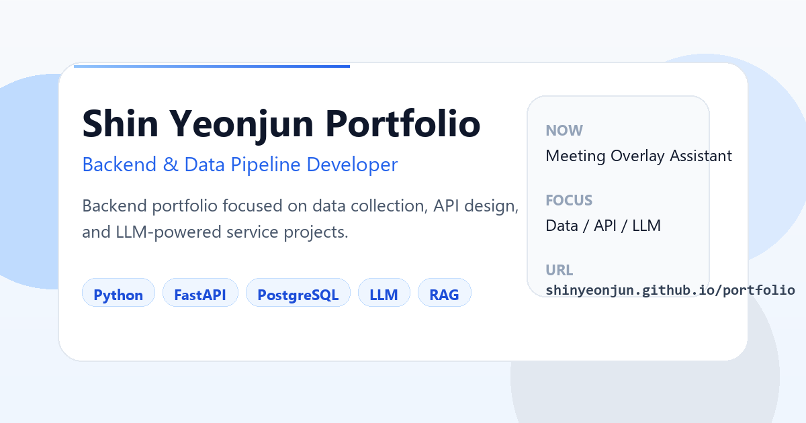

# Shin Yeonjun

Python/FastAPI 기반의 백엔드·데이터 파이프라인 개발자입니다. AI 기능을 API, 데이터 저장소, 비동기 작업, 사용자 화면까지 연결하는 제품형 프로젝트를 만듭니다.

## Focus

- **Backend & data:** Python, FastAPI, PostgreSQL, Redis, pgvector, Supabase, Docker
- **Product delivery:** API와 데이터 흐름을 UI·데스크톱 도구·자동화까지 연결
- **Engineering practice:** 재현 가능한 실행 경로, 테스트·검증, 설계 문서와 데모를 함께 남김

## Selected projects

- [CAPS — Meeting Overlay Assistant](https://github.com/shinyeonjun/meeting-overlay-assistant): 회의 중 overlay와 회의 후 workspace/report를 분리한 로컬 AI 회의 보조 시스템. FastAPI, PostgreSQL/pgvector, Redis worker, Tauri를 사용합니다.
- [Backend Visual Map](https://github.com/shinyeonjun/visual_map): 백엔드 코드와 RDB 메타데이터의 관계를 탐색하는 Windows 우선 Rust/Tauri 개발 도구입니다.
- [Database Memory MCP](https://github.com/shinyeonjun/rdb-memory-mcp): 스키마 메타데이터만으로 관계·영향도·diff를 다루는 Rust CLI/MCP 서버입니다. 공개 release binary를 제공합니다.
- [DE-pipeline](https://github.com/shinyeonjun/DE-pipeline): YouTube 데이터를 Raw → Clean → Mart로 적재하고 FastAPI 분석 API·Next.js 대시보드·챗봇까지 연결한 데이터 파이프라인입니다.
- [AgentOS](https://github.com/shinyeonjun/AgentOS): AI coding agent의 변경을 격리 workspace에서 검토·승인한 뒤에만 동기화하는 안전한 개발 워크스페이스 런타임입니다.

## More

- Portfolio: <https://shinyeonjun.github.io/portfolio/>
- GitHub: <https://github.com/shinyeonjun>
- Email: <mailto:plosind@naver.com>
